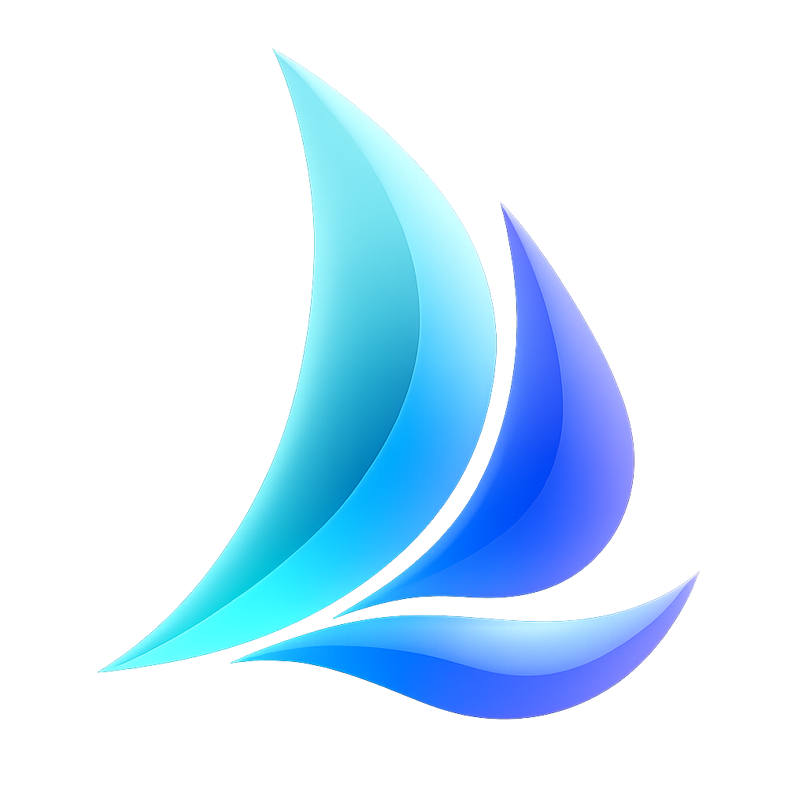

# Vela

<p align="center">
  
</p>

Vela 是一款原生 macOS Mihomo 网络代理客户端，面向希望清楚掌握配置、节点、规则、连接和系统网络状态的用户。

> A native Mihomo client for macOS, built around transparent state, safe configuration workflows, and first-class system integration.

## 功能

- 管理本地 YAML 配置与远程订阅，并在应用前完成结构验证。
- 浏览代理组和节点、测试延迟并快速切换当前节点。
- 独立控制系统代理与 TUN 系统网卡，两种接管方式可以叠加使用。
- 在规则、全局和直连路由策略之间切换。
- 查看活动连接、规则、订阅用量、日志、诊断和常用服务解锁测试。
- 支持简体中文和英文界面。

## 系统要求

- Apple Silicon Mac
- macOS 15 或更高版本
- Xcode 16 或更高版本（从源码构建）

## 从源码构建

```bash
git clone git@github.com:Spacebody/Vela.git
cd Vela
xcodebuild \
  -project Vela.xcodeproj \
  -scheme Vela \
  -configuration Debug \
  -derivedDataPath /tmp/VelaDerivedData \
  CODE_SIGNING_ALLOWED=NO \
  build
```

未签名构建可以用于开发和大部分非特权功能。系统代理、TUN、特权辅助组件及正式分发需要有效的 Apple Developer 签名与对应授权。

## 验证

运行不修改系统网络状态的静态检查与单元测试：

```bash
./script/ci_test.sh --static-only
```

涉及系统代理、TUN 或特权辅助组件的集成测试必须在已签名、隔离且明确授权的环境中执行。

## 安全与隐私

Vela 会在修改系统网络状态前明确呈现操作。订阅凭据存储在 macOS 钥匙串中，诊断导出与特权操作均由用户主动触发。

安全问题请通过 GitHub 的 [Security Advisories](https://github.com/Spacebody/Vela/security/advisories/new) 私下报告。

## 相关链接

- [产品网站](https://vela.yilin.dev)
- [问题反馈](https://github.com/Spacebody/Vela/issues)
- [Mihomo](https://github.com/MetaCubeX/mihomo)

Mihomo 与其他第三方组件分别遵循其自身许可证；相关声明随对应组件保留。
